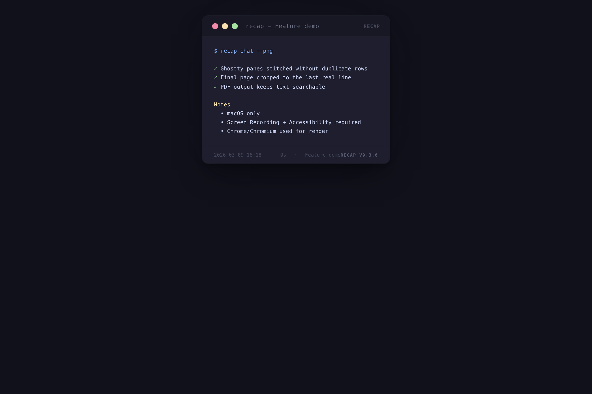
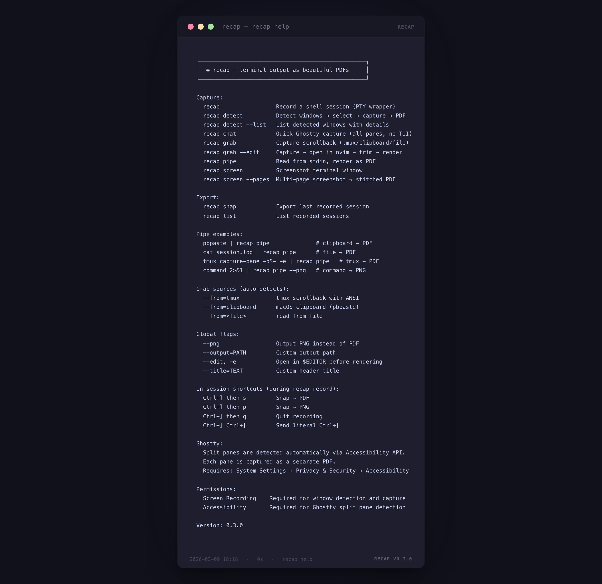

# recap

Terminal sessions as beautiful PDFs and PNGs. Catppuccin Mocha theme, styled window chrome, zero config.

recap captures terminal output from multiple sources — live recording, window detection, scrollback, clipboard, stdin, screenshots — and renders it through a styled HTML template into publication-ready PDFs or PNGs via headless Chrome.

## Screenshots

<p>
  
  
</p>

## Version 0.3.0

- Ghostty quick-capture via `recap chat`
- Scroll-stitch overlap trimming and final-page bottom cropping
- Searchable/copyable text preserved in the HTML/PDF Ghostty path

## Requirements

- **macOS** (uses CoreGraphics, Accessibility API, screencapture)
- **Go 1.23+**
- **Chrome or Chromium** (used headlessly by [chromedp](https://github.com/chromedp/chromedp) for HTML-to-PDF/PNG rendering)

## Build

```sh
go build -o recap .
```

Or install directly into your `$GOPATH/bin`:

```sh
go install .
```

## macOS Permissions

| Permission | Where | Required for |
|---|---|---|
| Screen Recording | System Settings > Privacy & Security > Screen Recording | Window detection and screenshot capture |
| Accessibility | System Settings > Privacy & Security > Accessibility | Ghostty split pane detection |

## Commands

### Capture

| Command | Description |
|---|---|
| `recap` | Record a live shell session (PTY wrapper) |
| `recap detect` | Detect visible windows, select with TUI, capture to PDF |
| `recap detect --list` | List all detected windows with details |
| `recap detect --all` | Capture all detected windows |
| `recap chat` | Quick Ghostty capture — auto-finds first Ghostty window, captures all panes |
| `recap grab` | Capture scrollback (auto-detects tmux or clipboard) |
| `recap grab --edit` | Capture, open in `$EDITOR` to trim, then render |
| `recap pipe` | Read from stdin, render as PDF |
| `recap screen` | Interactive screenshot — click a window to capture |
| `recap screen --pages` | Multi-page screenshot capture, stitched into a single PDF |
| `recap claude` | Render a Claude Code JSONL conversation |

### Export

| Command | Description |
|---|---|
| `recap snap` | Export the last recorded session to PDF/PNG |
| `recap list` | List all recorded sessions |

### Info

| Command | Description |
|---|---|
| `recap version` | Print version |
| `recap help` | Show help |

## Flags

| Flag | Description |
|---|---|
| `--png` | Output PNG instead of PDF |
| `--output=PATH`, `-o` | Custom output path |
| `--edit`, `-e` | Open in `$EDITOR` before rendering |
| `--title=TEXT` | Custom header title (pipe/grab) |
| `--from=SOURCE` | Grab source: `tmux`, `clipboard`, or a file path |
| `--session=ID` | Target a specific session (snap/claude) |
| `--pages` | Multi-page screenshot mode (screen) |
| `--list` | List mode (detect) |
| `--all`, `-a` | Capture all windows (detect) |

## In-Session Shortcuts

During `recap record` (PTY mode), use Ctrl+] chords:

| Shortcut | Action |
|---|---|
| `Ctrl+]` then `s` | Snap current session to PDF |
| `Ctrl+]` then `p` | Snap current session to PNG |
| `Ctrl+]` then `q` | Quit recording |
| `Ctrl+]` `Ctrl+]` | Send literal Ctrl+] |

## Pipe Examples

```sh
# Clipboard to PDF
pbpaste | recap pipe

# File to PDF
cat session.log | recap pipe

# tmux scrollback with ANSI colors
tmux capture-pane -pS- -e | recap pipe

# Command output to PNG
command 2>&1 | recap pipe --png

# With custom title
echo "hello world" | recap pipe --title="demo"
```

## Output Locations

| Source | Default output |
|---|---|
| `recap pipe`, `recap grab`, `recap screen`, `recap detect`, `recap chat` | `~/Desktop/recap-*.pdf` |
| `recap claude` | `~/Downloads/recap-claude-*.pdf` |
| `recap snap` | `~/Desktop/recap-<session-id>.pdf` |
| Recorded sessions | `~/.recap/sessions/<id>/` |

## How It Works

1. **Capture** — content is collected via one of: PTY recording, CGWindowListCopyWindowInfo + screencapture, tmux capture-pane, pbpaste, stdin, or Accessibility API (Ghostty panes)
2. **ANSI to HTML** — raw terminal output with ANSI escape codes is converted to styled HTML spans
3. **Template** — content is wrapped in a Catppuccin Mocha themed HTML template with window chrome (title bar, traffic light dots, footer)
4. **Render** — headless Chrome (via chromedp) renders the HTML to PDF (`PrintToPDF`) or PNG (`FullScreenshot`)

### Ghostty Split Panes

When a Ghostty window has split panes, recap uses the macOS Accessibility API to detect pane boundaries, then captures each pane individually. For panes with scrollback, it performs scroll-stitch capture — scrolling through content and stitching multiple screenshots into a single continuous output.
